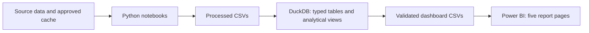

# Macro Regime & Market Risk Monitor

**Are US and Eurozone financial markets behaving consistently with their macroeconomic regimes?**

This project classifies each region's growth and inflation environment, compares equities, credit and rates with earlier matching regimes, and presents the evidence in a five-page Power BI report. It connects **Python → DuckDB SQL → financial analysis → Power BI** in a reproducible analytical workflow.

## Start here

- [Employer guide](docs/recruiter_guide.md): project scope, evidence of reporting skills and practical limits.
- [Three-page research note](docs/research_summary.pdf): financial interpretation and scenario watchlist.
- [Five Power BI report pages](powerbi/README.md): the finished dashboard views.


## Findings at a glance

**Saved analysis snapshot: 2026Q2.** The US is classified as **Stagflation** and the Eurozone as **Overheating**. Both record **zero market-stress points under the monitor’s defined stress framework**, while expected real 2Y rates are higher than their historical regime medians.

| Evidence | US: Stagflation | Eurozone: Overheating |
|---|---:|---:|
| Quarterly equity price return | S&P 500: **14.9%** | EURO STOXX 50: **13.6%** |
| Earlier matching-regime median equity return | −9.6% | −9.4% |
| Current credit / sovereign spread | Baa–10Y: **Omitted** | Italy–Germany 10Y: **0.77 pp** |
| Earlier matching-regime median spread | Omitted | 1.57 pp |
| Expected real 2Y rate proxy | **1.28%** | **0.56%** |
| Quarterly market-stress count | **0 of 3** | **0 of 3** |
| Earlier matching quarters, excluding 2026Q2 | **4** | **3** |

Baa credit-spread levels omitted from the public exhibit because of third-party data-use restrictions. The credit channel remains included in the model.

**Assessment:** the macro regimes appear partially reflected in market conditions. Risk assets and spreads are more resilient than the historical comparisons, while the expected-real-rate proxies indicate greater monetary restraint. This is a descriptive interpretation of mixed evidence, rather than a fair-value estimate or forecast of an inevitable correction.

The watchlist considers two possible developments: macro conditions normalize toward resilient market pricing, or persistent macro pressure begins appearing in weaker equities and wider spreads. [Read the three-page research summary](docs/research_summary.pdf) or its [text version](docs/research_summary.md).

## Workflow



- **Python:** downloads or reads cached FRED/ALFRED, ECB, Eurostat and Yahoo Finance inputs; aligns calendars; classifies regimes; calculates market indicators; validates exports.
- **SQL:** loads three typed source tables, builds seven analytical views, runs 33 validation checks and exports five dashboard tables.
- **Financial analysis:** compares the current quarter with earlier quarters in the same regional regime and translates the differences into a descriptive pricing assessment and authored repricing watchlist.
- **Power BI:** presents the executive overview, macro classification, market pricing, historical benchmarks/watchlist and historical explorer. [Browse all five screenshots](powerbi/README.md).

## Methodology

| | Inflation < 3% | Inflation ≥ 3% |
|---|---|---|
| Quarterly GDP growth > 0.5% | Goldilocks | Overheating |
| Quarterly GDP growth ≤ 0.5% | Deflationary Slowdown | Stagflation |

Inflation is the quarterly average of three monthly annual-inflation observations. US annualized GDP growth is converted to quarterly growth before classification.

Each region has three market-stress channels:

- **US:** negative S&P 500 return; Baa spread increase above 0.05 percentage points; negative 10Y–2Y curve.
- **Eurozone:** negative EURO STOXX 50 return; negative 10Y–2Y curve; widening Italy–Germany 10Y spread.

Expected real rates are separate monetary-condition indicators. They contribute **no market-stress points**. Multi-channel stress means at least two signals in either region. [Full methodology](docs/methodology.md) · [Data dictionary](docs/data_dictionary.md) · [Sources and data availability](data/README.md).

## Repository guide

| Location | Contents |
|---|---|
| `notebooks/` | Two final analytical notebooks |
| `sql/` | Six SQL scripts, execution helper and CSV contracts |
| `data/` | Source manifest, documented macro outputs and local snapshot locations |
| `powerbi/screenshots/` | Five final report pages |
| `docs/` | Methodology, dictionary, reproduction, validation and research summary |
| `run_notebooks.py` | Execute each notebook in a separate fresh kernel |
| `verify_snapshot.py` | Verify all six public CSVs, or the complete local snapshot, against the manifest |

## Reproduction

The complete local package reproduces the approved snapshot from its hashed source cache. The public repository contains code, documentation, screenshots and macro outputs; full licensed market datasets and the embedded-data `.pbix` are retained locally. Full reproduction from a public clone requires access to the complete approved cache. [Reproduction instructions](docs/reproduction.md) explain both packages and their limits.

With Python 3.12 and the complete authorized cache, run from the repository root:

```powershell
python -m pip install -r requirements.txt
python run_notebooks.py
python sql/run_sql.py
python verify_snapshot.py --require-complete
```

Outputs go to `data/processed/`; the rebuilt DuckDB database and execution records go to `analysis/`. Reconnect a local Power BI report to the five dashboard CSVs before refreshing it. A public clone can run `python verify_snapshot.py` to verify the included macro and watchlist files without installing analytical dependencies.

## Validation and practical limits

The portable copy completed both notebooks in fresh kernels and all 33 SQL checks. Regenerated outputs were compared with the approved snapshot. [Validation evidence](docs/validation.md) records the packaging checks and the earlier analytical verification.

- The historical cross-asset sample contains **70 quarters, 2008Q4–2026Q2**. The US Stagflation and Eurozone Overheating matching samples are small and clustered in time.
- October 2025 US CPI is missing; the required three-month inflation coverage therefore excludes **2025Q4** from the quarterly regime sample. Missing values are retained.
- The project deliberately retains the GDP vintage behind the original analysis. It describes a **saved snapshot**, rather than the newest available data. Retrieval dates and source vintages are distinguished in the manifest.
- Equity returns are unadjusted-close **price returns**, excluding dividends. The expected-real-rate measures are proxies with different regional expectation sources.
- Macro regimes use published data and revisions; this project does not demonstrate a point-in-time trading strategy. Historical contrasts establish no causal relationship or forecast accuracy.
- The watchlist is authored scenario commentary; trigger evaluation and scheduled refresh are future work.

## Future automation

The next development phase will orchestrate source refresh, Python, DuckDB validation and Power BI-ready exports, with dated snapshots and explicit review when regimes change. Scheduled execution and automated trigger evaluation are **planned**, not implemented. [Automation roadmap](docs/automation_roadmap.md).

## Publication and reuse

The public repository omits raw Baa data and explicit spread levels. It retains the project’s calculated indicators and authored analysis, with source attribution. Raw Baa data and the complete market-data exports are not distributed in the public repository. Code, schemas, methodology, credit signals, stress counts and authored watchlist commentary remain included. The complete local analytical project retains its full inputs and outputs. See [data availability](data/README.md) and [code/documentation licensing](LICENSING.md).
