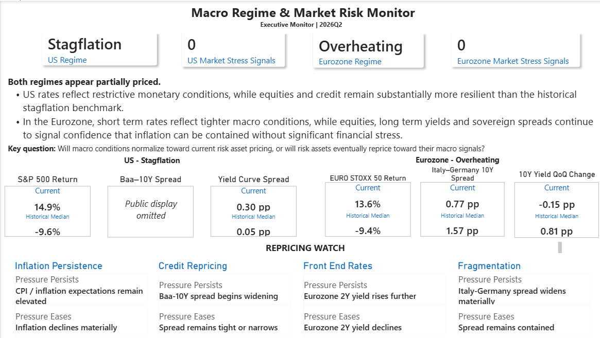
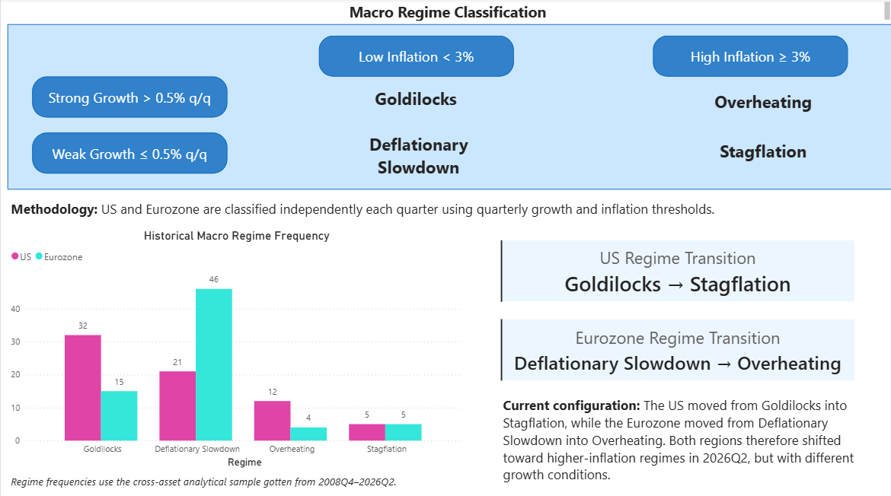
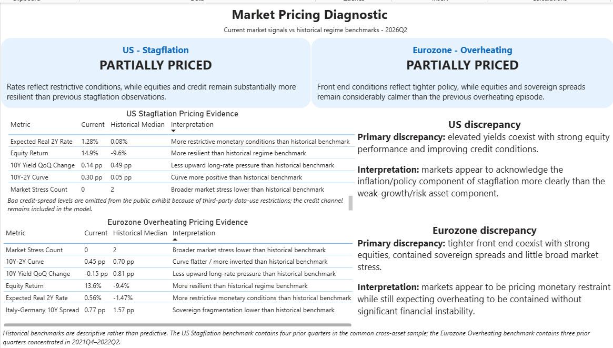
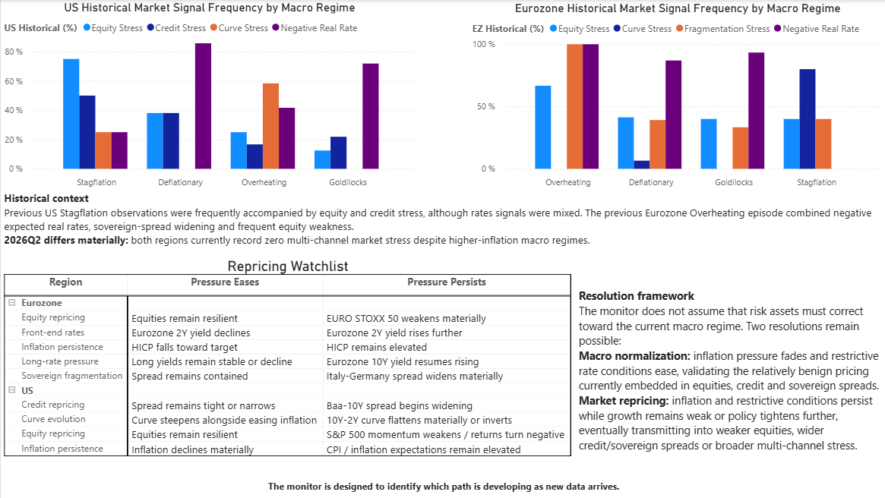
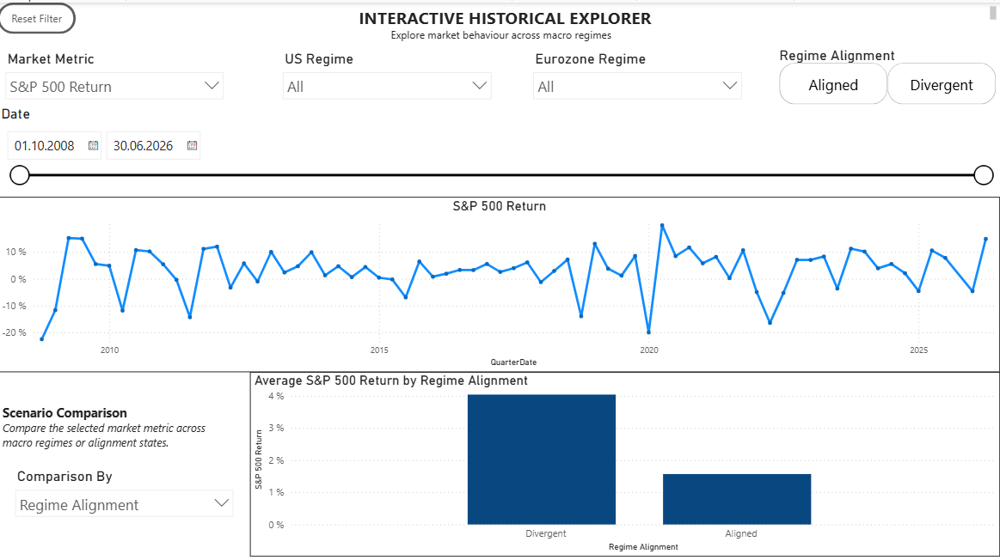

# Power BI report

The report has five pages. Public screenshots omit explicit Baa spread levels; the credit channel and its derived indicators remain part of the analysis.

## 1. Executive Monitor

Current regional regimes, stress counts, headline benchmark comparisons and selected repricing triggers. The Baa metric label remains visible with its levels omitted.



## 2. Macro Regimes

The growth/inflation classification matrix, historical frequencies in the common cross-asset sample and the latest regional transitions.



## 3. Market Pricing

Current-versus-historical comparisons with the descriptive pricing assessment and benchmark sample-size footnote. The public US exhibit omits the Baa spread-level row and retains the credit interpretation and stress-count evidence.



## 4. Historical Benchmark & Repricing Watchlist

Historical market-signal frequencies and the authored nine-row watchlist. Negative real rates in the charts describe monetary conditions; they do not contribute to market-stress counts.



## 5. Interactive Historical Explorer

Market metric, regional regime, alignment and date selections, plus scenario comparisons. The screenshot shows the S&P 500 selection over the full 2008Q4–2026Q2 timeline; the local report contains the interactive controls.



## Local report and source connections

The complete local package contains `Macro_Regime_Market_Risk_Monitor.pbix` with its saved imported snapshot. The public repository presents screenshots and excludes the binary report and embedded market datasets. The local analytical report retains the full credit channel and data.
For a local refresh, use the corresponding files under `data/processed`:

| Table | CSV |
|---|---|
| `powerbi_monitor` | `powerbi_monitor.csv` |
| `current_regime_benchmark` | `current_regime_benchmark.csv` |
| `current_pricing_comparison` | `current_pricing_comparison.csv` |
| `current_pricing_diagnostic` | `current_pricing_diagnostic.csv` |
| `repricing_watchlist` | `repricing_watchlist.csv` |

Review each CSV query's **Source** step in Power Query and change its file location to the matching processed file in the checkout. Retain subsequent transformations and the existing table/column names, then apply and refresh. The Text/CSV connector and its Source step are documented by [Microsoft](https://learn.microsoft.com/en-us/power-query/connectors/text-csv). Desktop source-setting interfaces vary by version; the [new experience limitations](https://learn.microsoft.com/en-us/power-bi/transform-model/power-query-new-experience-limitations) explain why a legacy Change Source action may be absent.

CSV source paths are a local setup step. Reconnect them before refreshing the saved report from a different checkout.

## Latest-quarter US stress card

The executive card displays the latest quarterly market-stress count:

```dax
Current US Market Stress =
VAR LatestQuarter =
    CALCULATE(
        MAX(powerbi_monitor[QuarterDate]),
        ALL(powerbi_monitor)
    )
RETURN
    CALCULATE(
        MAX(powerbi_monitor[us_market_stress_count]),
        ALL(powerbi_monitor),
        powerbi_monitor[QuarterDate] = LatestQuarter
    )
```

The measure reads the exported count and ignores historical filters for the latest-quarter card. `QuarterDate` is derived from the quarter key in the report model; the source CSV has 24 columns. Expected real rates remain separate monetary-condition indicators and contribute no stress points.

## Formatting and interpretation

CSV equity returns are numbers in percent units: 14.87 means 14.87%, not 0.1487. Rates are percent levels; spreads and rate changes are percentage points. Historical share fields are fractions between 0 and 1 and may be displayed as percentages.

The US historical stress-count median is 1.5; a screenshot table formats it as 2 with zero decimals. The methodology and research summary retain the underlying 1.5. Treat all displayed figures as rounded values. The narrative pricing labels summarize descriptive comparisons; they do not establish what investors believe or predict that markets must reprice.

## Public exhibits and sources

Baa credit-spread levels omitted from the public exhibit because of third-party data-use restrictions. The credit channel remains included in the model. The public repository omits raw Baa data and explicit spread levels. It retains the project’s calculated indicators and authored analysis, with source attribution.

Pages 1 and 3 use manually prepared public screenshots. Page 4 retains the historical Credit Stress frequency because it is a derived signal. Pages 2 and 5 contain no Baa spread-level exhibits. The screenshot treatment changes presentation only.

Macro sources: BEA/BLS through FRED/ALFRED and Eurostat/ECB. Market sources: Yahoo Finance index/FX closes, ECB/ESCB government yields, Cleveland Fed expectations through FRED, and the Moody’s Baa yield underlying FRED/FRB St. Louis BAA10YM. The repricing watchlist is authored project commentary. See the [source inventory and attribution links](../data/README.md) for the series and provider terms.
